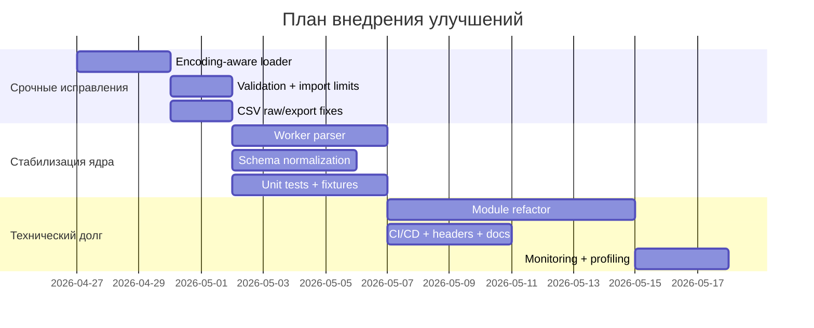

# Полное ревью проекта log-graph-v091

## Executive summary

По предоставленным артефактам проект выглядит как автономное клиентское приложение на HTML/CSS/JavaScript для визуализации технологических логов с локальным хранением сессий и данных в браузере. В текущем пакете доступны только `log-graph-v091.html` и один пример лога `22-02-2026_12-00_OPRCH_v4_.txt`; репозиторий, CI-конфиги, lockfile, vendor-папка, тесты и деплой-артефакты не приложены, поэтому выводы ниже относятся именно к доступным артефактам и помечают отсутствующие элементы как «не указано». Судя по содержимому HTML, это фактически одностраничное приложение с drag-and-drop загрузкой файлов, парсером широкого и группового табличного форматов, несколькими режимами графиков, экспортом CSV/PNG, маркерами, пресетами и хранением сессий в IndexedDB (`log-graph-v091.html:625-717`, `1753-1818`, `2525-2701`, `3694-4088`, `4425-4765`).

Сильные стороны проекта видны сразу. Архитектурно выбран правильный вектор для браузерного инструмента анализа логов: локальная работа без внешних сервисов, IndexedDB для объёмных сессий, downsampling, переключение на WebGL, быстрый путь через `Plotly.react`, встроенная подробная справка по формату, навигации и экспорту (`log-graph-v091.html:357-616`, `4844-5000`, `5011-5314`). Официальная документация Plotly действительно рекомендует использовать `react/relayout/update` для более эффективного апдейта существующих графиков, а `scattergl` — как WebGL-вариант для работы с более тяжёлыми сериями. citeturn3search0turn4search0turn4search8

Однако в текущем виде я бы оценил проект как **хороший pilot/POC, но не production-ready для промышленной эксплуатации**. Основные причины: жёстко монолитная реализация в одном HTML-файле, отсутствие предоставленных тестов и CI, UTF-8-only загрузка входных файлов, неглубокая валидация импортируемых сессий, отсутствие схемы качества/статуса данных, риск потери символов в CSV-экспорте, а также ограниченная масштабируемость из-за обработки больших файлов целиком в основном потоке (`log-graph-v091.html:1338-1355`, `1448-1459`, `1590-1750`, `1762-1765`, `2525-2606`, `4709-4723`). Для заказчика это означает: **концепт ценен и продуктово зрел по UX, но технический долг уже заметен и должен быть закрыт до масштабирования на реальные производственные объёмы и чувствительные данные**.

Ниже — сводная таблица проблем и приоритетов.

| ID | Атрибут | Проблема | Серьёзность | Приоритет | Доказательство |
|---|---|---|---|---|---|
| D1 | Формат данных / ввод | Загрузка логов идёт только через `file.text()`; кодировка входа не управляется | высокая | P0 | `log-graph-v091.html:1762-1765` |
| D2 | Экспорт данных | «Сырой» CSV на самом деле интерполирует/ресемплирует значения на объединённую временную ось | высокая | P0 | `log-graph-v091.html:2525-2595` |
| D3 | Схема данных | В групповом формате предусмотрен `status`, но он нигде не используется; качество данных теряется | высокая | P0 | `log-graph-v091.html:1621`, `1694-1711`; отсутствие использования `sc` в остальном коде |
| A1 | Архитектура | Вся логика сосредоточена в одном HTML-файле, общая mutable-state модель `S`, сильная связанность UI и logic | средняя | P1 | `log-graph-v091.html:625-717`, `2792-3168`, `5011-5459` |
| Q1 | Качество кода | Есть дублирование между overlay/single render-path, магические таймауты и смешение concern’ов | средняя | P1 | `log-graph-v091.html:3145-3148`, `4621-4628`, `5050-5204`, `5324-5444` |
| T1 | Тесты | В предоставленных артефактах нет unit/e2e-тестов, покрытия, fixtures, CI | высокая | P0 | по предоставленному пакету доступен только HTML и пример лога |
| S1 | Безопасность | Импорт сессий и маркеров валидируется поверхностно; нет лимитов по размеру/количеству | высокая | P0 | `log-graph-v091.html:4063-4082`, `4687-4723` |
| S2 | Безопасность / хранение | Чувствительные логи и маркеры сохраняются в браузерном storage без режима «эпhemeral/не сохранять» | средняя | P1 | `log-graph-v091.html:391-400`, `522-523`, `607-616`, `4425-4558` |
| P1 | Производительность | Файлы читаются целиком, парсятся целиком, обрабатываются в main thread; нет Worker/streaming | высокая | P0 | `log-graph-v091.html:1591-1593`, `1753-1769`, `2161-2259`, `4844-5000` |
| P2 | Экспорт / локализация | Кастомный CP1251-энкодер не покрывает часть символов, включая `°`, и может портить тех. обозначения | высокая | P0 | `log-graph-v091.html:1338-1355`, `2525-2601`; в логе есть `[°C]` на `22-02-2026_12-00_OPRCH_v4_.txt:2` |
| O1 | Эксплуатация | CI/CD, деплой, мониторинг и runbook не указаны и не предоставлены | средняя | P2 | в пакете отсутствуют соответствующие артефакты |
| L1 | Зависимости / комплаенс | Есть ссылка на `vendor/plotly-3.5.0.min.js`, но сами vendor-файлы, lockfile и license notice не предоставлены | средняя | P1 | `log-graph-v091.html:621` |

## Объём анализа и недостающие артефакты

В анализ вошли два файла:

- `log-graph-v091.html` — основной артефакт приложения;
- `22-02-2026_12-00_OPRCH_v4_.txt` — пример входного лога.

Есть и важное допущение по идентификации продукта: имя файла говорит `log-graph-v091`, а внутри HTML и справки фигурирует `PA·GRAPH v0.9.0` (`log-graph-v091.html:6`, `194`, `354`). Я исхожу из того, что это один и тот же релиз/артефакт, просто с разными именами упаковки.

По доступному коду можно уверенно сказать только следующее:

- **Язык реализации:** HTML/CSS/JavaScript, vanilla frontend.
- **Основная библиотека графиков:** локально подключаемый bundle Plotly (`vendor/plotly-3.5.0.min.js`) — см. `log-graph-v091.html:621`.
- **Инфраструктура, backend, серверная часть, контейнеризация, CI/CD, мониторинг:** **не указано**.
- **Объём репозитория целиком:** **не указано**; у меня нет доступа к остальным файлам проекта.

Если нужен полный заказной аудит именно репозитория, а не только артефакта, стоит приложить ещё:

- архив или URL репозитория;
- `vendor/` или package manager manifests (`package.json`, `package-lock.json`, `pnpm-lock.yaml`, `go.mod`, `requirements.txt` — что применимо);
- CI-конфиги (`.github/workflows`, GitLab CI, Jenkinsfile);
- инструкции запуска (`README`, `Makefile`, `docker-compose.yml`, `Dockerfile`);
- тесты и отчёты покрытия;
- конфиги деплоя/infra (`nginx.conf`, Helm, Terraform, k8s manifests) — если есть;
- образцы больших логов, а не только one-sample;
- результаты SAST/SCA/Dependency scan — если уже запускались;
- политику лицензий и NOTICE-файлы.

## Архитектурный анализ

Архитектурно проект — это статическое однофайловое приложение, где почти вся функциональность работает вокруг глобального namespace `S`, разделённого по доменам (`ui`, `data`, `view`, `style`, `plot`, `cursor`, `markers`, `zoom`, `t0`, `anomaly`, `presets`). Это хороший признак в том смысле, что автор осознаёт важность единого источника истины, но на масштабе уже видно, что код дорос до потребности в модульной декомпозиции (`log-graph-v091.html:625-717`).

Плюс по выбранным решениям: использование entity["company","Plotly","data visualization"], переход на `scattergl` при больших сериях, кэширование подготовленных трасс и fast-path через `Plotly.react` — технически разумные решения для браузерного анализатора логов. Они согласуются с официальной документацией Plotly по обновлению графиков и WebGL-трассам. citeturn3search0turn4search0turn4search8

```mermaid
flowchart LR
    U[Пользователь] --> UI[HTML UI<br/>drag&drop / controls / help]
    UI --> HF[hf()<br/>загрузка файлов]
    HF --> P[parse()<br/>разбор wide/group]
    P --> S[(S.data.AP / FN / SEL)]
    S --> T[prepareTraceData()<br/>filter / ds / smooth / anomaly]
    T --> G[Plotly overlay / split / XY]
    S --> E[Экспорт CSV / PNG / save file]
    S --> LS[localStorage<br/>presets / markers]
    S --> IDB[IndexedDB<br/>sessions]
```

**A1. Монолитная однофайловая архитектура — средняя серьёзность.**  
Главный технический долг — приложение целиком собрано внутри одного HTML-документа: стили, разметка, обработчики, парсер, математика, storage, экспорт и логику графиков. На это указывают `script`-блок с основной логикой (`log-graph-v091.html:622-5688`) и смешение UI-функций вроде `updSide()` с вычислительными функциями вроде `matInv()`, `downsample()`, `computeBollinger()`, `prepareTraceData()` (`log-graph-v091.html:1480-1576`, `2161-2259`, `4798-4824`, `4864-5000`). Практическое следствие: низкая тестопригодность, повышенная стоимость изменений, сложный code review и риск регрессий при доработке любого участка.

**A2. Дублирование render-path и магические тайминги — средняя серьёзность.**  
Логика построения overlay и single chart частично продублирована: похожие участки по построению traces/layout/shapes/markers повторяются в `buildOverlaySpec()` и `buildSingleSpec()` (`log-graph-v091.html:5050-5204`, `5324-5444`). Дополнительно есть несколько мест, где синхронизация состояния завязана на жёсткие таймауты — debounce `80ms`, отложенный apply `40ms`, и особенно восстановление zoom через `900ms` после загрузки сессии (`log-graph-v091.html:3145-3148`, `5312`, `4621-4628`). Это неустойчиво: при медленном браузере или тяжёлых данных восстановление может срабатывать раньше/позже фактической готовности графика.

**A3. Архитектурный плюс: локальность и отсутствие внешней сети.**  
По доступному HTML не видно вызовов `fetch`, `XMLHttpRequest`, WebSocket или сторонних API; встроенная справка прямо говорит «Всё локально, никаких внешних сервисов» (`log-graph-v091.html:608-616`). Для анализатора технологических логов это очень хороший продуктовый выбор: меньше surface area, проще согласование с ИБ и с эксплуатацией в закрытых контурах.

Рекомендуемое архитектурное направление:

```text
src/
  app/
    state.js
    bootstrap.js
  parser/
    wide.js
    grouped.js
    normalize.js
    schema.js
  chart/
    trace-prep.js
    plotly-overlay.js
    plotly-single.js
    markers.js
  storage/
    presets.js
    sessions-idb.js
    session-file.js
  export/
    csv.js
    png.js
  tests/
    parser.spec.js
    export.spec.js
    session.spec.js
```

Такой рефакторинг снизит связанность и сделает возможными unit-тесты по парсеру, экспорту, нормализации и восстановлению сессий.

## Формат данных и схема

По примеру лога видно, что текущий основной рабочий сценарий — **wide-format, разделитель табуляция**, опциональная строка `%PAHEADER%`, затем общие колонки `Дата`, `Время`, `мс`, метка времени и далее значения параметров (`22-02-2026_12-00_OPRCH_v4_.txt:1-4`). В конкретном примере:

- есть `%PAHEADER%` в первой строке;
- заголовок начинается с `Дата`, `Время`, `мс`, `Метка времени (Шаг 100мс)`;
- далее идут **13 колонок параметров**;
- шаг дискретизации — **100 мс**, что видно уже по строкам 3–12;
- временной диапазон образца — от `12:00:00.000` до `12:09:34.800` (`22-02-2026_12-00_OPRCH_v4_.txt:3-12`, `5744-5751`).

```mermaid
flowchart LR
    F[TXT/TSV лог] --> H[Заголовок<br/>Date/Time/ms/+ value columns]
    H --> N[Нормализация имён тегов и unit]
    N --> T[Построение timestamp]
    T --> R[Ряды параметров<br/>{tag, unit, sourceFile, data[]}]
    R --> Q[Качество / статус / timezone]
    Q --> V[Отрисовка / экспорт / хранение]
```

**D1. Входная кодировка жёстко прибита к UTF-8 — высокая серьёзность.**  
Загрузка входного файла делается через `const text = await file.text();` (`log-graph-v091.html:1762-1765`). Это выглядит удобно, но для промышленного контекста СНГ это один из самых рискованных дефектов: многие выгрузки SCADA/PLC по-прежнему приходят в Windows-1251 или UTF-16LE. Пример лога содержит кириллицу в заголовках (`22-02-2026_12-00_OPRCH_v4_.txt:2`), поэтому проблема сразу влияет на названия тегов и единицы измерения. По документации entity["company","Mozilla","browser vendor"] MDN `Blob.text()` **всегда** декодирует как UTF‑8, тогда как `TextDecoder` и чтение `ArrayBuffer` позволяют выбирать кодировку. citeturn2search0turn7search0turn7search1

Рекомендация и пример патча:

```js
async function readFileTextSmart(file) {
  const buf = new Uint8Array(await file.arrayBuffer());
  const encodings = ['utf-8', 'windows-1251', 'utf-16le', 'utf-16be'];

  let fallback = null;
  for (const enc of encodings) {
    try {
      const text = new TextDecoder(enc, { fatal: true }).decode(buf);
      const probe = text.replace(/\r\n/g, '\n').split('\n').slice(0, 2).join('\n');
      if (/^%PAHEADER%/.test(probe) || /\b(Дата|Date)\t(Время|Time)\t(мс|ms)/.test(probe)) {
        return { text, encoding: enc };
      }
      fallback ??= { text, encoding: enc };
    } catch (_) {}
  }
  if (fallback) return fallback;
  throw new Error(`Не удалось определить кодировку файла: ${file.name}`);
}
```

И дальше в `hf()` нужно заменить `file.text()` на `readFileTextSmart(file)` и сохранять `encoding` в `_fileStore`, чтобы при обратном `saveFile()` не ломать round-trip.

**D2. «Сырой» CSV не является сырым — высокая серьёзность.**  
По UX и тексту справки пользователь ожидает, что экспорт `CSV сырой` отдаст «все точки всех выбранных параметров» (`log-graph-v091.html:573-579`). Но фактическая реализация строит **объединённое множество timestamp’ов по всем сериям** и затем для каждой серии делает либо `interpY()`, либо `interpStep()` (`log-graph-v091.html:2568-2595`). То есть в многосерийном асинхронном сценарии экспорт синтезирует значения, которых в исходных логах не было. В текущем приложенном примере это не проявляется, потому что wide-format имеет общий шаг 100 мс для всех 13 колонок (`22-02-2026_12-00_OPRCH_v4_.txt:3-12`), но для склеенных файлов или grouped-format это опасная ошибка отчётности.

Рекомендация: разделить два режима экспорта:

- **raw-long**: строки вида `timestamp;tag;value;unit;source_file`;
- **aligned-wide**: отдельный осознанный режим с интерполяцией, так и назвать.

Минимальный патч:

```js
function exportCsvRawLong(params) {
  const rows = [['timestamp', 'tag', 'value', 'unit', 'source_file']];
  for (const p of params) {
    for (const d of filt(p.data)) {
      rows.push([
        fmtTsExcel(d.ts),
        p.tag,
        fmtNumExcel(d.val),
        p.unit || '',
        p.sourceFile || ''
      ]);
    }
  }
  return rows.map(r => r.join(';')).join('\r\n');
}
```

**D3. Семантика timestamp и timezone недоопределена — средняя серьёзность.**  
Парсер wide-format умеет распознать дополнительную колонку «Метка времени (Шаг 100мс)» и даже пропустить её при поиске первых value-columns (`log-graph-v091.html:1639-1654`), но при формировании timestamp фактически используется только триада `Дата + Время + мс` через `new Date(year, month, day, ...)` (`log-graph-v091.html:1694-1709`). Между тем уже в строке 3 примера есть `1774155600000000`, что похоже на микросекундный epoch timestamp (`22-02-2026_12-00_OPRCH_v4_.txt:3`). Это значит, что проект уже сталкивается со схемой, где есть **два времени**: локальное человекочитаемое и машинное/epoch. Сейчас одно из них фактически игнорируется, а timezone не документирован.

Для заказчика это риск межплощадочного обмена, сопоставления событий из разных часовых поясов и корректности экспортируемых сессий.

**D4. Качество данных и `status`-поле теряются — высокая серьёзность.**  
В help явно описан групповой формат как последовательность из пяти колонок, включая `status` (`log-graph-v091.html:598-604`). В объект параметра поле `sc` действительно закладывается (`log-graph-v091.html:1621`), но в цикле разбора данных оно нигде не используется: читаются `ds`, `ts`, `ms`, `vs`, а `status` игнорируется (`log-graph-v091.html:1693-1711`). Это серьёзный архитектурный пробел для промышленной телеметрии. В приложенном wide-логе несколько датчиков прямо маркированы фразой «Показания датчика или подмена» (`22-02-2026_12-00_OPRCH_v4_.txt:2`), то есть контур качества/подмены для этого домена действительно значим.

Рекомендация: хранить рядом с каждой точкой ещё и `quality/status`, а в UI дать:

- фильтр «только достоверные точки»;
- отдельную подсветку `BAD/SUBSTITUTED`;
- опцию исключения bad-quality из сглаживания, статистики и аномалий.

**D5. Схема не нормализует служебные Unicode-символы и неполна по unit-метаданным — средняя серьёзность.**  
В заголовке примера есть скрытый символ `U+200E` перед несколькими русскими именами, например в фрагменте `PLC01.Sensors.a63fg_xq01 \u200eДавление... [бар]` и ещё в нескольких sensor-columns из той же строки заголовка (`22-02-2026_12-00_OPRCH_v4_.txt:2`). Кроме того, часть колонок содержит явно указанные units (`[Гц]`, `[°C]`, `[бар]`, `[psi]`), а часть — нет, хотя единицы по смыслу есть: `DWATT`, `CTIM`, `ATIM` и ряд позиций клапанов в той же строке 2. Это снижает качество поиска, автоконверсии и осмысленность экспортов.

Рекомендованная каноническая схема входного ряда:

| Поле | Тип | Обязательность | Комментарий |
|---|---|---:|---|
| `timestamp_us` | int64 | да | каноническое время, брать из epoch-колонки при наличии |
| `timestamp_local` | string with offset | желательно | для отображения и аудита timezone |
| `tag` | string | да | нормализованный тег без bidi/control chars |
| `display_name` | string | нет | человекочитаемое имя |
| `unit` | string | желательно | отдельная unit-метка, не только эвристика из headers |
| `quality` | enum/bitmask | желательно | good/bad/substituted/... |
| `source_file` | string | да | происхождение точки |
| `value` | number | да | фактическое значение |

**D6. Эвристика discrete/analog слишком грубая — средняя серьёзность.**  
`detectDiscrete()` считает дискретным только параметр, состоящий исключительно из `0` и `1` (`log-graph-v091.html:1448-1459`). Это слишком узко для индустриальных логов. В текущем sample есть `TNR ( Speed/Load Set Point )`, который весь фрагмент равен `103,600000` (`22-02-2026_12-00_OPRCH_v4_.txt:2-12`, `5744-5751`): это типичный setpoint/ступенчатый сигнал, но по текущему правилу он трактуется как analog. Значит, тип сигнала лучше определять не только эвристикой по данным, а schema-driven флагом `signal_kind = analog | binary | step | setpoint`.

**D7. Конверсия единиц измерения деструктивна — средняя серьёзность.**  
Текущая реализация меняет исходные значения `p.data[i].val` in-place и одновременно переписывает Lo/Hi (`log-graph-v091.html:4254-4268`). Для образца это относится как минимум к сериям с `[°C]`, `[бар]`, `[psi]` в строке 2 примера. Такая стратегия делает преобразование необратимо зависящим от порядка действий пользователя и накапливает ошибки округления. Для production-аналитики лучше хранить **raw values + display transform**, а не перетирать исходные данные.

## Качество кода, тесты и документация

Код написан не хаотично: в нём очень много комментариев, объясняющих мотивацию, есть встроенная help-система, подсказки по UX, достаточно ровный стиль именования крупных подсистем и явное стремление к self-documented logic (`log-graph-v091.html:625-629`, `357-616`). Это серьёзный плюс: проект делался с заботой о конечном пользователе и с инженерной рефлексией.

Но по качеству реализации уже видны признаки перерастания «одного файла» в систему.

**Q1. Смешение уровней абстракции — средняя серьёзность.**  
В одном и том же скрипте соседствуют:

- низкоуровневая математика (`matMul`, `matInv`, `sgCoeffs`) — `log-graph-v091.html:2188-2257`;
- бизнес-логика парсинга/склейки — `1590-1818`;
- state/storage — `3699-3740`, `4367-4765`;
- UI-конструирование DOM — `2833-3112`;
- построение Plotly specs — `5050-5459`.

Это затрудняет локальные изменения. Пример: изменение формата единиц затрагивает и parser, и sidebar UI, и annotations, и export.

**Q2. Дублирование и ручная численная математика без защитного пояса тестов — средняя серьёзность.**  
Сглаживание Савицкого–Голея и линейная алгебра реализованы кастомно (`log-graph-v091.html:2161-2257`). Сам по себе этот выбор допустим, но без unit-тестов на численную корректность он опасен. Особенно это касается edge-cases: короткие ряды, null-gap, шумные данные, нечётное/чётное окно, сингулярные матрицы. Здесь нет признаков тестового контура, а fallback при проблемах сводится к среднему окну (`log-graph-v091.html:2200-2204`).

**T1. Покрытие тестами — фактически отсутствует в предоставленных артефактах, высокая серьёзность.**  
Мне не переданы ни unit-тесты, ни fixtures, ни e2e-сценарии, ни отчёты покрытия. Для продукта такого класса минимально необходимы:

- parser tests для wide/group formats;
- regression tests на merging/export/session import;
- snapshot/e2e tests на базовые пользовательские сценарии;
- property-based tests на timestamp ordering и dedup;
- golden-fixtures на русские заголовки, CP1251, `°C`, `psi`, hidden Unicode.

Минимальный скелет unit-теста мог бы выглядеть так:

```js
import { parse } from '../src/parser/index.js';

test('wide-format with %PAHEADER% parses 13 params and 5749 rows', () => {
  const res = parse(sampleText, []);
  expect(res.e).toBeNull();
  expect(res.p).toHaveLength(13);
  expect(res.p[0].data[0].ts).toBeDefined();
});
```

**Doc1. Документация для пользователя — хорошая; для сопровождения — недостаточная.**  
Встроенная справка действительно сильная: она покрывает начало работы, формат файла, storage model, export, performance, hotkeys, T=0, markers и т. д. (`log-graph-v091.html:357-616`). Но сопровождаемость команды заказчика требует ещё и репозиторной документации, которой в доступных артефактах нет: README, changelog, ADR, release notes, compatibility matrix, test strategy, runbook восстановления corrupted sessions, описание поддерживаемых кодировок и формата входа.

## Безопасность, производительность, масштабируемость и эксплуатация

С точки зрения threat model у проекта есть хороший базовый плюс: он не зависит от внешнего API и хранит всё локально. Но локальное хранение — не автоматически безопасное. API `localStorage` действительно сохраняет данные бессрочно, а OWASP прямо рекомендует не считать browser storage доверенной зоной и не складывать туда чувствительные данные без необходимости. IndexedDB подходит для больших структурированных данных, но по умолчанию браузер хранит такие данные в best-effort режиме, а не как гарантированно persistent storage. citeturn1search1turn1search2turn8search0turn2search23

**S1. Импорт сессий валидируется слишком поверхностно — высокая серьёзность.**  
В `_handleSessionFileImport()` после чтения JSON проверяется лишь наличие `payload.ap` как массива (`log-graph-v091.html:4709-4712`), после чего объект почти сразу пишется в IndexedDB и подсовывается в `loadSession()` (`log-graph-v091.html:4715-4727`). Нет лимитов на размер файла, число параметров, длину массивов `x/y`, глубину объекта, типы полей, строки огромной длины, переполнение числовых значений. Аналогично импорт маркеров допускает произвольный массив c минимальной проверкой `ts` (`log-graph-v091.html:4063-4082`). Это открывает путь как минимум к denial-of-service через очень большой JSON.

Пример защитного патча:

```js
const MAX_SESSION_FILE_MB = 50;
const MAX_PARAMS = 500;
const MAX_POINTS_PER_PARAM = 2_000_000;
const MAX_MARKER_TEXT = 2000;

function validateImportedSession(payload) {
  if (!payload || !Array.isArray(payload.ap)) {
    throw new Error('Некорректная сессия: нет массива ap');
  }
  if (payload.ap.length > MAX_PARAMS) {
    throw new Error(`Слишком много параметров: ${payload.ap.length}`);
  }
  for (const p of payload.ap) {
    if (!Array.isArray(p.x) || !Array.isArray(p.y)) {
      throw new Error(`Серия ${p.tag || '(без тега)'} не содержит x/y`);
    }
    if (p.x.length !== p.y.length) {
      throw new Error(`Разная длина x/y у ${p.tag}`);
    }
    if (p.x.length > MAX_POINTS_PER_PARAM) {
      throw new Error(`Серия ${p.tag} слишком большая`);
    }
  }
}
```

**S2. Хранение чувствительных логов в browser storage без режима “не сохранять” — средняя серьёзность.**  
Сессии пишутся в IndexedDB, маркеры и пресеты — в `localStorage` (`log-graph-v091.html:391-400`, `522-523`, `607-616`, `4425-4558`). Это удобно, но для эксплуатационного контура с технологическими данными нужен хотя бы выбор:

- режим **ephemeral** — ничего не сохранять между запусками;
- режим **private session** — хранить только текущую вкладку;
- режим **persistent** — явное согласие пользователя.

Если проект будет открываться под общей корпоративной учёткой или на общих рабочих станциях, этот риск нужно считать реальным. Рекомендация entity["organization","OWASP","appsec foundation"] по browser storage в целом именно такая: не хранить чувствительное локально без строгой необходимости и не доверять содержимому storage как безопасному. citeturn2search23turn2search3

**S3. Строгий CSP в текущем виде затруднён — средняя серьёзность.**  
В файле есть большой inline `<style>` (`log-graph-v091.html:7`) и большой inline `<script>` (`log-graph-v091.html:622`). Это делает внедрение строгой Content Security Policy неудобным: либо придётся использовать nonce/hash, либо временно разрешать inline-ресурсы. При этом сама CSP — один из стандартных способов снижения риска XSS и data injection. Дополнительно для статической раздачи стоит включить `X-Content-Type-Options: nosniff`. citeturn2search2turn0search0

Рекомендуемый nginx-фрагмент после выноса JS в отдельный файл:

```nginx
add_header Content-Security-Policy "default-src 'self'; script-src 'self'; style-src 'self' 'unsafe-inline'; img-src 'self' data: blob:; connect-src 'none'; object-src 'none'; base-uri 'none'; frame-ancestors 'none'" always;
add_header X-Content-Type-Options "nosniff" always;
add_header Referrer-Policy "no-referrer" always;
add_header Permissions-Policy "camera=(), microphone=(), geolocation=()" always;
```

**P1. Производительность ограничена main-thread архитектурой — высокая серьёзность.**  
Парсер сначала читает файлы целиком в память, затем делает `split('\n')`, затем строит объект на каждую точку, затем поверх этого выполняет downsampling, сглаживание, расчёт Bollinger и рендер (`log-graph-v091.html:1591-1593`, `1711`, `1762-1765`, `2161-2259`, `4844-5000`). Это означает:

- двукратное/трёхкратное дублирование данных в памяти;
- блокировку UI на больших файлах;
- тяжёлые вычисления в основном потоке.

Технически это главный ограничитель масштабируемости. Документация MDN по Web Workers прямо рекомендует выносить ресурсоёмкие вычисления в отдельный поток, чтобы не блокировать основной пользовательский поток. citeturn1search4turn1search9

Рекомендуемая skeleton-схема:

```js
// main thread
const worker = new Worker(new URL('./parser.worker.js', import.meta.url), { type: 'module' });

async function parseInWorker(file) {
  const buffer = await file.arrayBuffer();
  worker.postMessage({ name: file.name, buffer }, [buffer]);
}

// parser.worker.js
self.onmessage = async ({ data }) => {
  const bytes = new Uint8Array(data.buffer);
  const text = new TextDecoder('utf-8').decode(bytes); // заменить на smart-detect
  const parsed = parse(text, []);
  self.postMessage(parsed);
};
```

**P2. Кастомный CP1251-энкодер портит символы технических единиц — высокая серьёзность.**  
Функция `toCp1251()` поддерживает ASCII, кириллицу, `№`, кавычки-ёлочки и тире, но не поддерживает, например, знак градуса `°` (`log-graph-v091.html:1338-1355`). При этом в реальном лог-файле уже есть параметр с unit `[°C]` (`22-02-2026_12-00_OPRCH_v4_.txt:2`). Значит, при CSV-экспорте такой unit будет преобразован в `?C`. Это не косметика — это порча инженерного обозначения в отчёте. Дополнительно строка с пользовательским описанием маркеров/заголовков тоже может потерять символы вне узкого набора.

Рекомендация:

- сделать **UTF-8 BOM** экспорт режимом по умолчанию;
- legacy-режим CP1251 — оставить как опцию для старых Excel;
- если legacy критически нужен, расширить таблицу соответствий как минимум символами `°`, `µ`, `±`, `Δ`.

**P3. Выбор IndexedDB для сессий — правильный, но persistence policy не доведена до конца.**  
Использование IndexedDB вместо localStorage для больших сессий — сильное решение; MDN действительно позиционирует IndexedDB как хранилище для крупных структурированных данных, в отличие от Web Storage. Но браузерные квоты являются оценочными, данные по умолчанию best-effort, а `navigator.storage.persist()` в проекте не используется. citeturn1search2turn1search15turn8search0turn8search5

То есть help обещает пользователю почти надёжное долговременное хранение, а на практике оно всё равно зависит от политики браузера и storage pressure (`log-graph-v091.html:391-400`, `4425-4440`). Это надо либо документировать честнее, либо сделать запрос persistent storage там, где поддерживается.

**O1. Эксплуатация, CI/CD, деплой, мониторинг — не указано.**  
По артефактам не видно:

- pipeline lint/test/build/security scan;
- способа выпуска релизов;
- профилирования производительности;
- мониторинга ошибок;
- деплой-конфига статического приложения;
- регламента хранения чувствительных данных.

Это не означает, что всего этого нет, но в доступном наборе оно отсутствует, а значит зрелость эксплуатации оценить нельзя.

Минимальный CI-контур после выноса JS в `src/` мог бы быть таким:

```yaml
name: web-ci

on:
  push:
  pull_request:

jobs:
  validate:
    runs-on: ubuntu-latest
    steps:
      - uses: actions/checkout@v4
      - uses: actions/setup-node@v4
        with:
          node-version: 22
      - run: npm ci
      - run: npm run lint
      - run: npm run test
      - run: npm run test:e2e
```

## Зависимости, лицензии, риски и дорожная карта

Ниже — таблица зависимостей, которые можно достоверно вывести из доступного артефакта.

| Зависимость | Версия | Роль | Лицензия | Статус по артефактам |
|---|---:|---|---|---|
| `plotly.js` | `3.5.0` | графики, интерактив, экспорт PNG | MIT | ссылка на `vendor/plotly-3.5.0.min.js` есть, сам bundle не предоставлен |
| `localStorage` | browser built-in | пресеты, маркеры, миграция legacy | N/A | используется напрямую |
| `IndexedDB` | browser built-in | хранение сессий | N/A | используется напрямую |
| `CompressionStream` / `DecompressionStream` | browser built-in | gzip экспорт/импорт сессий | N/A | используется опционально, с fallback не везде симметрично |
| File / Blob APIs | browser built-in | чтение логов и импортов | N/A | используется напрямую |

По официальным материалам Plotly bundle `3.5.0` соответствует MIT-лицензируемой ветке Plotly.js; публично найденные релевантные уязвимости для `plotly.js` в официальных базах касались версий `<1.16.0` (XSS, CVE-2017-1000006) и `<2.25.2` (prototype pollution, CVE-2023-46308). Поскольку в HTML явно указан `plotly-3.5.0.min.js`, можно сделать осторожный вывод, что проект **вероятно не попадает** под эти конкретные диапазоны. Но это именно осторожный вывод: без предоставленного vendor-файла или lockfile невозможно проверить фактический bundle, его hash и происхождение. Проверка по базе уязвимостей entity["organization","NIST","standards institute"] NVD и официальным материалам Plotly это подтверждает. citeturn3search4turn4search2turn5search3turn6search1

### Приоритетный план работ

| Этап | Задача | Результат | Трудоёмкость | Риск |
|---|---|---|---:|---|
| P0 | Encoding-aware loader + сохранение исходной кодировки | корректная загрузка CP1251/UTF-16/UTF-8, честный round-trip | 12–16 ч | средний |
| P0 | Валидация импортов сессий/маркеров + лимиты размеров | защита от DoS и corrupted payload | 10–14 ч | низкий |
| P0 | Исправить `raw CSV` и разделить raw-long / aligned-wide | отсутствие скрытой интерполяции | 10–14 ч | средний |
| P0 | Исправить CSV-экспорт текстов/units | пропадают `°`, `µ`, спецсимволы | 6–10 ч | низкий |
| P0 | Вынести parser/heavy math в Worker | снижение лагов UI на больших логах | 24–36 ч | средний |
| P1 | Нормализовать схему данных: timezone, quality/status, Unicode cleanup | корректная межсистемная интерпретация | 16–24 ч | средний |
| P1 | Ввести unit-тесты + golden fixtures + regression suite | снижение числа регрессий | 20–28 ч | средний |
| P1 | Разделить код на модули parser/chart/storage/export | рост сопровождаемости | 32–48 ч | высокий |
| P2 | Добавить CI/CD, security headers, runbook, release notes | эксплуатационная зрелость | 12–18 ч | низкий |
| P2 | Добавить perf instrumentation и error reporting | контролируемая эксплуатация | 8–12 ч | низкий |



### Примерные команды для локального запуска, тестирования и профилирования

Для **текущего статического артефакта**:

```bash
# Python
python -m http.server 8080

# Node.js
npx serve .

# После запуска:
# открыть http://localhost:8080/log-graph-v091.html
```

Для **планируемого тестового контура**, если код будет разнесён по модулям:

```bash
# Node.js
npm ci
npm run lint
npm test
npm run test:e2e
node --cpu-prof ./src/index.js
```

```bash
# Python
python -m venv .venv
source .venv/bin/activate
pip install -r requirements.txt
pytest -q
pytest --cov
python -m cProfile -o profile.prof path/to/app.py
```

```bash
# Go
go test ./... -cover
go test ./... -bench=. -benchmem
go test ./... -run '^$' -bench . -cpuprofile cpu.prof
go tool pprof cpu.prof
```

### Итоговая оценка для заказчика

Если смотреть глазами заказчика, у проекта уже есть рыночная ценность: продукт функционально богат, ориентирован на реальный сценарий разбора логов и очень неплох по UX для чисто браузерного инструмента. Но технически он сейчас находится в точке, где дальше «докручивать поверх» уже опасно. Сначала нужно закрыть P0-контур: кодировки, импорт/валидация, честный raw-export, исправление CSV-энкодинга и вынос тяжёлого парсинга из main thread. После этого можно переходить к модульной чистке и CI.

В таком порядке проект превращается из удачного инженерного файла-утилиты в управляемый, поддерживаемый и безопасный продукт.