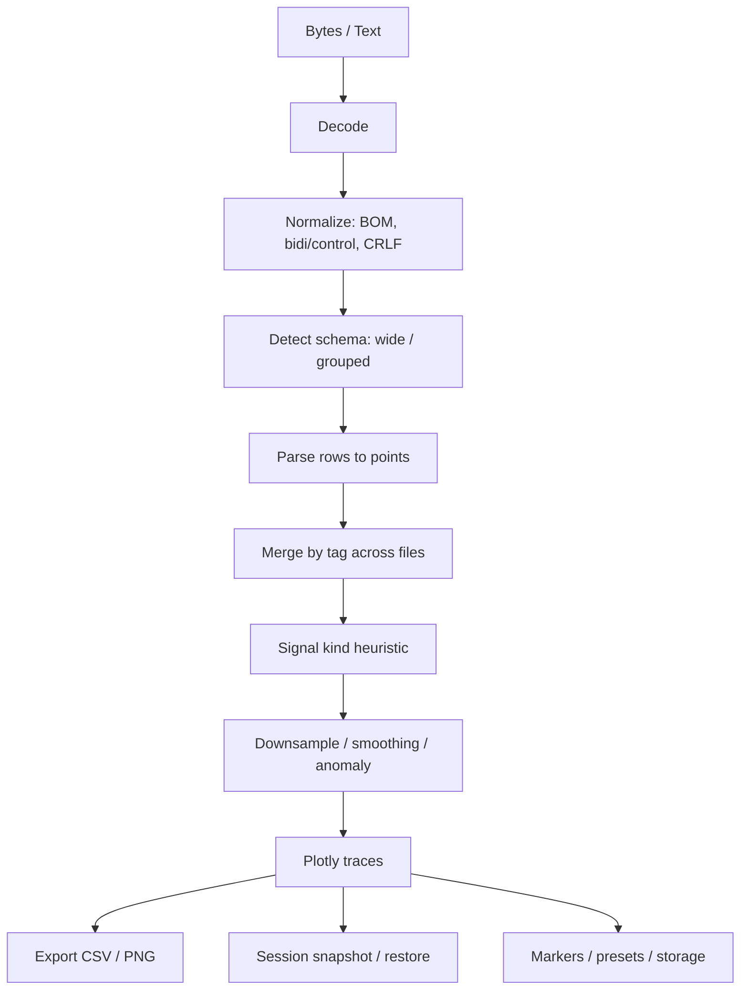

# Полное ревью проекта log-graph-v091

## Executive summary

По коду видно, что значительная часть прошлых замечаний действительно была исправлена **на уровне нового runtime-кода**: появились smart-decoding входных логов (`utf-8`, `windows-1251`, `utf-16`), очистка скрытых bidi/control-символов, сохранение `status` и `epochUs`, вынос тяжёлого парсинга и precompute в workers, более строгая валидация импортируемых сессий, лимиты размеров, gzip-экспорт сессий, откат unit-conversion по raw-значениям. Это серьёзный шаг вперёд. Источник: `app.js`, строки 157–165, 789–867, 1244–1525, 2332–2438, 4115–4157, 4418–4760; `parser.worker.js`, строки 3–223; `trace.worker.js`, строки 3–165; `RELEASE_NOTES.ru.md`, строки 5–25.

Главная проблема в другом: **поставляемый entrypoint сейчас внутренне противоречив**. Файл `log-graph-v091.html` не подключает `app.js`, а содержит собственный встроенный JavaScript, который заметно старее: читает файлы через `file.text()`, не использует smart-decoding, не сохраняет `status`/`epoch`, не запускает `parser.worker.js`/`trace.worker.js`, а меню экспорта и сессий не совпадает с тем, что описано в `README`/`RUNBOOK` и поддерживается в `app.js`. Иначе говоря, исправления есть, но **не собраны в единый релизный артефакт**. Источник: `log-graph-v091.html`, строки 202–220, 600–616, 621, 1590–1788, 4428–4715; `app.js`, строки 257–286, 1424–1525, 2332–2438, 4418–4760; `README.ru.md`, строки 17–41; `RUNBOOK.ru.md`, строки 13–63.

Итоговая оценка строгая: **как кодовая ветка — прогресс заметный; как поставка/релиз — проект пока не готов к закрытию ревью**. Блокер не столько в алгоритмах, сколько в целостности сборки, воспроизводимости и доказуемости качества. Тесты, покрытие и CI заявлены, но в предоставлённом наборе артефактов не приложены, поэтому подтвердить production-readiness нельзя. Источник: `README.ru.md`, строки 17–41; `RUNBOOK.ru.md`, строки 13–19, 55–63; `RELEASE_NOTES.ru.md`, строки 20–25.

| Область | Вердикт |
|---|---|
| Логика парсинга и обработки | Существенно усилена в `app.js` / workers |
| Целостность релизного артефакта | Неудовлетворительно |
| Производительность для small/medium | Хорошая по архитектуре и локальному замеру |
| Масштабируемость для large logs | Ограничена batch-only моделью |
| Безопасность и приватность | Неплохо для offline, но CSP и сборка не доведены |
| Тесты / покрытие / CI | Не подтверждены, покрытие не указано |

## Объём анализа и структура проекта

Анализ выполнен **по предоставлённым файлам**, а не по полному репозиторию. Поэтому всё, чего нет в наборе, помечено как **«не предоставлено»** или **«не указано»**.

```text
log-graph-v091/
├── log-graph-v091.html                  # standalone entrypoint, inline CSS/JS
├── app.js                               # внешний runtime-код с большей функциональностью
├── styles.css                           # внешний CSS
├── parser.worker.js                     # worker парсинга и декодирования
├── trace.worker.js                      # worker precompute/downsampling
├── README.ru.md                         # краткая документация
├── RUNBOOK.ru.md                        # эксплуатация и чек-лист
├── RELEASE_NOTES.ru.md                  # описание hardened build
├── SECURITY_HEADERS.ru.md               # рекомендации по HTTP/CSP
├── 22-02-2026_12-00_OPRCH_v4_.txt       # sample wide-log
├── vendor/plotly-3.5.0.min.js           # упомянуто, не предоставлено
├── package.json                         # не предоставлено
├── tests/                               # не предоставлено
├── .github/workflows/                   # не предоставлено
└── CHANGELOG.ru.md                      # упомянуто, не предоставлено
```

Источник: `README.ru.md`, строки 36–41; `RUNBOOK.ru.md`, строки 55–63; `SECURITY_HEADERS.ru.md`, строки 14–24; `log-graph-v091.html`, строка 621.

| Файл / модуль | Назначение | Оценка |
|---|---|---|
| `log-graph-v091.html` | Текущий пользовательский entrypoint; содержит inline CSS и inline JS | **Критический источник drift**: именно здесь запускается старый runtime, а не `app.js` |
| `app.js` | Наиболее зрелая версия runtime: smart decode, workers, session validation, richer export | **Сильный код**, но фактически не подключён текущим HTML |
| `parser.worker.js` | Декодирование байтов, определение кодировки, парсинг wide/grouped | Хорошее выделение CPU-heavy части |
| `trace.worker.js` | Downsampling/precompute trace data | Хорошее выделение render-precompute, но только частичное |
| `styles.css` | Внешний CSS | Полезен, но при текущем standalone HTML дублирует inline CSS |
| `README.ru.md` | High-level usage | Полезен, но частично расходится с поставляемым entrypoint |
| `RUNBOOK.ru.md` | Эксплуатация, диагностика, release checklist | Полезен, но содержит сценарии/пункты, которых нет в UI текущего HTML |
| `RELEASE_NOTES.ru.md` | Декларирует закрытие замечаний | На уровне `app.js` похоже на правду; на уровне поставки — нет |
| `SECURITY_HEADERS.ru.md` | Документ по hardening HTTP/CSP | Хороший, но сам же фиксирует незавершённость CSP из-за inline script/style |
| `22-02-2026_12-00_OPRCH_v4_.txt` | Единственный приложенный sample | Полезен, но покрывает только часть форматов и сценариев |

Ключевой вывод по структуре: сейчас у проекта **две расходящиеся «правды»** — `app.js` и встроенный JS в `log-graph-v091.html`. По прямому сравнению файлов внешний CSS синхронен с inline CSS, а внешний JS — нет: в `app.js` есть десятки функций и веток, которых нет во встроенном JS HTML, включая smart-decoding, worker-path, quality filter, diagnostics и жёсткую validation сессий. Это не косметика, а архитектурный дефект поставки.

## Данные и архитектура обработки

Проект строит **не граф в смысле узлы/рёбра**, а **интерактивные графики временных рядов**: overlay c несколькими `Y`-осями, single-chart по параметрам и XY-режим характеристик. Это важно: оценивать нужно пайплайн ingest → parse → normalize → merge → downsample → render, а не graph algorithms в классическом смысле. Источник: `app.js`, строки 1687–1807, 3015–3065, 5086–5348, 5360–5482.

Из кода поддерживаются два логических формата логов: **wide** и **grouped**. В wide-формате ожидаются общие колонки `Дата`, `Время`, `мс` и, опционально, метка времени/epoch; далее идут колонки параметров. В grouped-формате код ожидает повторяющиеся группы `Дата <тег>`, `Время <тег>`, `мс`, `status`, `value`. В `app.js`/`parser.worker.js` wide-путь умеет сохранить `epochRaw`/`epochUs`, grouped-путь умеет сохранить `status`. Но sample покрывает только wide-path. Источник: `app.js`, строки 1204–1346; `parser.worker.js`, строки 70–205; `log-graph-v091.html`, строки 1590–1751.

| Атрибут sample | Наблюдение |
|---|---|
| Формат | Wide TSV с `%PAHEADER%` |
| Строка заголовка | `Дата`, `Время`, `мс`, далее отдельная epoch-колонка и 13 сигналов |
| Десятичный разделитель | Запятая |
| Единицы | Смешанные: `[Гц]`, `%`, `[°C]`, `[бар]`, `[psi]` |
| Частота | 100 мс |
| Статус качества | В sample **не представлен** |
| Epoch | Есть отдельной колонкой в микросекундах |
| Скрытые символы | В заголовках присутствуют bidi/control-символы; новый parser их чистит |
| Несоответствие | Имя файла содержит `22-02-2026`, а контент начинается с `22-03-2026` |

Источник: `22-02-2026_12-00_OPRCH_v4_.txt`, строки 1–12; `app.js`, строки 800–805, 1208–1216, 1331–1336; `parser.worker.js`, строки 3–10, 76–84, 193–198.

```mermaid
flowchart LR
    A[Локальный лог-файл] --> B{Запуск}
    B -->|желаемый путь| C[HTML shell + app.js]
    B -->|текущий entrypoint| D[log-graph-v091.html inline JS]

    C --> E[parseFilePayload]
    E --> F[parser.worker.js или blob-fallback]
    F --> G[decodeBytesSmart + parseTextCore]
    G --> H[mergeParsedParams]
    H --> I[S.data.AP / _fileStore]
    I --> J[prepareTraceData / cache]
    J --> K[trace.worker.js precompute]
    K --> L[Plotly render]

    D --> M[file.text()]
    M --> N[старый inline parse()]
    N --> O[упрощённый merge/render]
```

Эта диаграмма важна потому, что **архитектура “по документам” и архитектура “по фактическому entrypoint” сейчас различаются**. Новый путь с workers и smart decode есть, но текущий HTML запускает старый путь. Источник: `README.ru.md`, строки 7–15; `app.js`, строки 1397–1525; `log-graph-v091.html`, строки 621, 1590–1788.



Архитектурно это **batch ETL**, а не streaming. Файл читается целиком, декодируется целиком, затем разбивается на массив строк, после чего для каждого ряда строятся объекты точек. Это просто и прозрачно, но именно поэтому масштабирование по памяти ограничено. Источник: `app.js`, строки 1244–1346, 1424–1469, 1538–1568.

| Узел | Реализация | Сложность | Комментарий |
|---|---|---:|---|
| Wide/grouped parsing | Проход по всем строкам и параметрам | `O(R × P)` | Для wide-логов с большим числом колонок стоимость быстро растёт |
| Merge по тегу | Конкатенация + `Set`-dedupe | `O(N)` в среднем | Dedupe только по `ts + val + status`, не по `ts` |
| Downsampling LTTB | `downsample()` | `O(N)` | Хороший компромисс для analog |
| Downsampling MinMax | `downsampleMinMax()` | `O(N)` | Сохраняет пики лучше LTTB в некоторых сериях |
| Discrete downsampling | `downsampleDiscrete()` | `O(N)` | Корректная стратегия для step/binary |
| XY pairing | closest-timestamp + sort by X | `O(|X| + |Y| + K log K)` | Для характеристик годится, но теряет временной порядок после сортировки |
| Render reuse | `Plotly.react` fast path | амортизированно лучше полного `newPlot` | Хорошее решение для UX |

Источник: `app.js`, строки 1054–1189, 1687–1807, 3015–3065, 4881–5036, 5253–5348; `trace.worker.js`, строки 3–165.

## Качество реализации, производительность, совместимость, тесты и деплой

По стилю код сильнее среднего для прикладного offline-инструмента: комментарии хорошие, доменные решения объяснены, mutable-state собран в namespace `S`, есть явные лимиты, fallback-пути и отдельные модули workers. Особенно хорошо выглядят `Plotly.react` fast path, `_ptdCache`, session snapshot в параллельных массивах и sanitization imported data. Источник: `app.js`, строки 3–100, 152–155, 4315–4559, 4881–5036, 5253–5348.

Основной минус качества кода — **монолитность и дублирование**. `app.js` остаётся большим «application god-file», в нём смешаны parsing, rendering, storage, markers, export, keyboard shortcuts и UI wiring. Плюс логика парсинга и преобразования размножена минимум в трёх местах: `app.js`, `parser.worker.js` и inline JS внутри `log-graph-v091.html`. Именно это дублирование уже привело к drift: hardened-логика существует, но в реальном entrypoint не используется. Вторая проблема — неудачные сокращения (`hf`, `updTB`, `_fs`, `pn`), ухудшающие читаемость для нового разработчика. Источник: `app.js`, строки 1528–1618, 2621–3030, 3565–4760, 4881–5723; `parser.worker.js`, строки 3–223; `log-graph-v091.html`, строки 1590–1788.

С точки зрения производительности архитектура здравая для small/medium наборов: есть `MAX_PTS = 5000`, переход на `scattergl` после 2000 display-поинтов, debounce render, precompute в `trace.worker.js`, LRU-кэш на 64 состояния. Локальный прогон приложенного sample в review-среде дал ориентировочно **~0.5 с на decode+parse** и **~0.06 с на trace precompute**; это подтверждает, что 1 MB / ~75k points проект обрабатывает комфортно. Но эти цифры **не валидируют** заявленные верхние лимиты 250 MB на входной файл и 12 млн точек на сессию. Источник: `app.js`, строки 157–165, 3015–3019, 1471–1525, 4881–5036; `trace.worker.js`, строки 95–165.

Для large logs есть архитектурный предел: `parseFilePayload()` читает файл целиком в `ArrayBuffer`, далее декодирует в строку, `parseTextCore()` разворачивает её в массив строк, а `hf()` грузит **все выбранные файлы параллельно** через `Promise.all`. Это означает высокий пик памяти и плохую масштабируемость на нескольких больших файлах. С практической точки зрения лимит `250 MB` выглядит оптимистичным: комфортный рабочий диапазон будет заметно ниже, особенно в обычном браузере на Windows-машине оператора. Источник: `app.js`, строки 1424–1469, 1538–1545, 1244–1247.

Совместимость продумана неплохо, но тоже не равномерно. В новой ветке есть parser worker plus fallback, optional gzip через `CompressionStream` with plain JSON fallback, session storage в IndexedDB, а `trace.worker.js` включается только при запуске по HTTP и при выключенном smoothing/anomaly. Это разумно. Но при прямом открытии standalone HTML текущий entrypoint деградирует сильнее, чем описано в документации: workers фактически не участвуют. Источник: `README.ru.md`, строки 7–15; `app.js`, строки 1428–1466, 1471–1525, 4669–4745; `log-graph-v091.html`, строки 1590–1788.

| Аспект | Статус |
|---|---|
| Тесты | **Заявлены**, но не предоставлены; `npm test` проверить невозможно |
| Покрытие | **Не указано** |
| CI/CD | В `RELEASE_NOTES` заявлен CI workflow, но `.github/workflows/` не приложен |
| Деплой | Только manual static hosting (`python -m http.server`) |
| Зависимости | Локальный Plotly из `vendor/plotly-3.5.0.min.js`; сам dependency не приложен |
| Browser support matrix | **Не указана** |
| Package manifest | `package.json` **не предоставлен** |

Источник: `README.ru.md`, строки 17–41; `RUNBOOK.ru.md`, строки 3–19; `RELEASE_NOTES.ru.md`, строки 20–25; `log-graph-v091.html`, строка 621.

## Риски, баги, безопасность и приватность

Приватностная модель у проекта в целом хорошая: работа локальная, code-paths не ходят в сеть, есть рекомендации по жёсткой CSP с `connect-src 'none'`, marker/session import снабжены sanitization и лимитами, а текст маркеров/аннотаций экранируется перед отдачей в Plotly. Это плюс. Источник: `SECURITY_HEADERS.ru.md`, строки 3–24; `app.js`, строки 789–805, 4400–4507.

Но security hardening не завершён. Сам документ по заголовкам прямо признаёт необходимость `unsafe-inline`, потому что `log-graph-v091.html` содержит inline script/style. Для offline-инструмента это допустимо, но для реального статического хостинга на общем origin — уже не лучший вариант. Плюс текущий standalone HTML не содержит новой server-grade validation логики, которая есть в `app.js`. Источник: `SECURITY_HEADERS.ru.md`, строки 14–24; `log-graph-v091.html`, строки 7–186, 1590–1788, 4687–4710; `app.js`, строки 4418–4760.

| Приоритет | Проблема | Почему это важно | Основание |
|---|---|---|---|
| **P0** | **Drift между `app.js` и `log-graph-v091.html`** | Исправления существуют, но в текущем entrypoint не исполняются | `log-graph-v091.html`: 202–220, 621, 1590–1788; `app.js`: 1424–1525, 2332–2438, 4418–4760 |
| **P0** | **Неполный релизный набор** | Без Plotly/vendor, `package.json`, тестов и CI артефактов релиз невоспроизводим и непроверяем | HTML: 621; `README.ru.md`: 17–41; `RELEASE_NOTES.ru.md`: 20–25 |
| **P1** | **Batch-only + параллельная загрузка всех файлов** | Высокий пик памяти, OOM-риск на multi-file / large-file сценариях | `app.js`: 1424–1469, 1538–1545 |
| **P1** | **Временная неоднозначность: `epochRaw` хранится, но не используется как source of truth** | Возможны расхождения timezone/DST и несогласованность wall-clock vs epoch | `app.js`: 1208–1216, 1217–1227, 1331–1336; sample: 2–5 |
| **P1** | **Политика merge для конфликтов по одному `tag`/`ts` не определена** | Конфликтующие точки из разных файлов остаются рядом и искажают анализ | `app.js`: 1350–1391 |
| **P1** | **UI/docs mismatch** | `RUNBOOK` требует `CSV сырой long` и diagnostics, текущий HTML их не даёт | `RUNBOOK.ru.md`: 42–63; `log-graph-v091.html`: 202–220 |
| **P2** | **Чрезмерная монолитность и дублирование логики** | Трудно сопровождать, легко снова получить drift | `app.js`: 3–5723; `parser.worker.js`: 3–223; HTML: 1590–1788 |
| **P2** | **Heuristic classification signal/quality** | Возможны ложные `step/binary` и ложные bad-quality решения | `app.js`: 203–209, 1054–1070 |
| **P2** | **`saveFile()` делает глобальный `replace()` по заголовку** | Потенциально может задеть лишние вхождения текста в header line | `app.js`: 2562–2618 |
| **P3** | **Внутренняя документация устарела** | Оператор и разработчик получают неверную картину возможностей | HTML help: 607–616; `README.ru.md`: 32–41; `RUNBOOK.ru.md`: 42–63 |

Отдельно стоит отметить два менее очевидных, но важных дефекта. Первый: grouped-format в parser logic жёстко ищет `Дата ...` и `Время ...`; wide-format частично допускает `Date/Time`, grouped English-шапки — фактически нет. Второй: sample file сам по себе не покрывает ни grouped-format, ни quality statuses, ни multi-file merge conflicts, ни CP1251/UTF-16, зато уже показывает несоответствие имени файла и фактической даты данных. Источник: `parser.worker.js`, строки 18–23, 112–205; sample: 1–5.

## Конкретные исправления и приоритеты

Главное исправление одно: **нужно перестать поставлять проект в виде двух расходящихся runtime-веток**. Без этого любые частные улучшения будут хрупкими.

| Приоритет | Исправление | Что именно сделать | Как валидировать |
|---|---|---|---|
| **P0** | Унифицировать entrypoint | Сделать одну source-of-truth сборку: HTML shell + `app.js` + `styles.css` + workers; standalone HTML генерировать только билдом, а не править вручную | Smoke-test: `log-graph-v091.html` реально грузит `app.js`; diff-check build vs source |
| **P0** | Закрыть артефактный состав | Приложить `vendor/plotly-3.5.0.min.js`, `package.json`, `tests/`, CI workflow | Чистый checkout должен запускаться и проходить `npm test` |
| **P1** | Убрать drift по функциональности | Либо добавить в UI `CSV сырой long`, `CSV выровненный`, diagnostics, quality filter, CP1251 export; либо удалить мёртвый код и обновить docs | Playwright smoke: все заявленные пункты меню реально доступны |
| **P1** | Снизить memory peak | Отказаться от `Promise.all` для больших файлов; сделать bounded concurrency 1–2; затем перейти к chunked/streaming parser | Perf-test: 2×100 MB не должны выбивать браузер по памяти |
| **P1** | Зафиксировать semantics времени | Явно выбрать режим: `wall-clock from columns` vs `epoch as source of truth`, плюс хранить timezone/sourceTZ в схеме | Golden tests: epoch/date mismatch, DST boundary, cross-timezone render |
| **P1** | Формализовать merge policy | Определить, что делать при одинаковом `tag` и `ts`: source precedence, keep-both with conflict marker, или audit report | Unit tests на конфликтующие файлы |
| **P2** | Разбить монолит | Вынести `parse-core`, `trace-core`, `storage`, `export`, `render`, `markers`, `time` в отдельные модули | Статический анализ + smaller unit tests per module |
| **P2** | Обновить документацию и встроенную help | Синхронизировать `README`/`RUNBOOK`/help/UI; убрать устаревшие фразы про localStorage-only sessions | Doc-to-UI checklist в CI |
| **P2** | Довести CSP | Вынести inline script/style, убрать `'unsafe-inline'` | CSP report-only → enforce |
| **P3** | Улучшить naming/typing | Переименовать краткие функции, добавить JSDoc/typedef, в идеале TypeScript | Lint + editor intellisense без догадок |

Минимальный набор тестов, которых сейчас не хватает для закрытия ревью:

- **Parser golden tests**: wide, grouped, CP1251, UTF-16LE/BE, hidden bidi chars, `status`, `epoch`, пустые строки, сломанные строки.
- **Artifact integrity tests**: текущий entrypoint действительно запускает новый parser/worker path; HTML меню соответствует docs.
- **Session tests**: oversized session reject, gzip/plain-json roundtrip, corrupted JSON, marker import limits.
- **Merge tests**: одинаковые `tag`/`ts` с одинаковыми и разными `val`, multi-file source tracking.
- **Performance budgets**: parse time, precompute time, peak heap, render latency, отсутствие long task > 200 ms на sample и на синтетических 10×/100× файлах.
- **Security tests**: XSS strings в markers/session import, CSP без inline после рефакторинга, no-network smoke (`connect-src 'none'`).

Дополнительные примеры данных, без которых ревью нельзя считать окончательно закрытым: **grouped-format sample**, **CP1251 sample**, **UTF-16 sample**, **sample с реальными `status`**, **sample с конфликтующими одинаковыми тегами из двух файлов**, **sample на границе суток/DST**, **очень широкий лог с сотнями колонок**, **очень длинный лог на десятки миллионов точек**. Сейчас это **не указано / не предоставлено**.

Финальный вердикт: **правки в коде есть и они содержательно хорошие, но релизная целостность не достигнута**. До устранения drift между `app.js` и `log-graph-v091.html`, до приложения тестов/CI и до подтверждения реальной сборки под текущий UI проект остаётся в статусе **«частично исправлен, но ревью не закрыто»**.